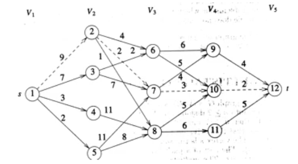

# Dynamic Programming

### 1. Dynamic Programming 이란? 
***일련의 결정들(sequence of decisions)의 결과로 해를 구하는 알고리즘 설계 방법***

* 예제 2. 최단 경로    
정점 i로 부터 j로의 최단 경로로  어느 정점을 결정해 나갈지 최단 경로를 결과로 내는 것. 

### 2. Principle of Optimality
***중간 결정(decision)에 대하여 그 이전의 결정들과 그  이후의 결정들 모두가 optimal*** 이어야 한다. 
최적성의 원칙은 성립하는 경우도 있고 아닌 경우도 있기 때문에 동적 프로그래밍을 설계하기 전에 고려해야한다. 

#### Greedy vs Dynamic
* Greedy    
오직 하나의 decision sequence가 만들어 진다. [Greedy Knapsack](https://github.com/JeongShin/AlgoStudyRepo/tree/master/Greedy#1---1-problem)
* Dynamic    
많은 decision sequence가 만들어져 최적의 가능성이 없는 순서열은 생성되지 않게 한다. 

### 예제 1.  Zero one Knapsack 
1. Problem    
Xi 의 값을 차례대로 결정. 즉, X1의 값, X2, X3...를 순서대로 결정하여 이익을 최대화 하는 것. 

2. Approach     
맨 처음 item 부터 i 번째 물건을 기준으로 
***max{i 번째 물건을 포함 했을때 최대 이익, i 번째 물건을 포함 안 했을때 최대 이익}*** 을 따진다
3. 
    1. 음수 용량이 오는 경우 이익은 -Infinity
     2. s n + 1 이 되는 경우 이익은 0 
#### Forward 접근 방법 
```aidl
// n : 물건 수 w : 무게 p : 이익 m : 배낭 크 
n = 3, w = (2, 3, 4) p = (1, 2, 5), m = 6 

// si의 최대 이익은 = max {si을 포함 X , si을 포함 O} 를 구한다. (i는 1부터) 
s1(6) = max { s2(6), s2(6 - 2) + 1 } // 해는 x1 포함 O 
s2(6) = max { s3(6), s3(6 - 3) + 2 } 
// 조건 2에 따라 s4의 이익은 0 (더 이상 아이템이 없기 때문)
s3(6) = max { s4(6), s4(6 - 4) + 5 } = max{0, 5} = 5
s3(3) = max { s4(3), s4(3 - 4) } = max{0, -∞} = 0
s2(6) = max { 5, 2 } = 5 
s2(4) = max { s3(4), s3(4 - 3) + 2} // 해는 x2이 포함 X 
s3(4) = max { s4(4), s3(4 - 4) + 5} = max {0, 5}= 5; // 해는 x3이 포함 O 
s3(1) = max { s4(1), s4(1 - 4) + 5} = max {0, -∞} = 0;
s2(4) = max {...}  = max {5, 2} = 5 
s2(6) = max {...} = max {5, 2} = 5 
s1(6) = max { s2(6), s2(4) + 1 } = max {5, 6} = 6 

// 결과 : x1 = 1, x2 = 0, x3 = 1, x1 -> x2 -> x3 순서로 결정됨
// solution s = [1, 0, 1] 
```

#### Backward 접근 방법
```aidl
// si의 최대 이익은 = max {si을 포함 X , si을 포함 O} 를 구한다. (i는 3부터) 
s3(6) = max {s2(6), s2(2)+5}
s2(6) = max {s1(6), s1(3)+2} 
s1(6) = max {s0(6), s0(4)+1} = max {0, 1} = 1
s1(3) = max {s0(3) ,s0(1)+1} = max {0, 1} = 1
s2(6) = max {1, 3} = 3
s2(2) = max {s1(2), s1(-1)+2}
s1(2) = max {s0(2), s0(0)+1} = max {0, 1} = 1
s2(2) = max {...} = max {1, -∞} = 1
s3(6) = max {s2(6), s2(2) + 5} = max {3, 1+5} = 6
// 결과 : x3 = 1, x2 = 0, x1 = 1, x3 -> x2 -> x1 순서로 결정됨 
// solution s = [1, 0, 1]
```

Tips! 문제에 따라 forward, backward 둘 중 하나만 적용 가능한 예도 있음. 

#### Dynamic 알고리즘의 일반적인 경향
* 최악의 경우 모든 d, decision sequence (선택 가지 수)에 따라 시간복잡도가 O(d^2)가 됨. zero - one 의 경우 d = 2
* recursion의 경우 이전에 계산된 값을 이용함으로 수행 시간을 줄일 수 있음 

### 예제 2.  Multistage Graphs

1. 문제    
    정점 s 에서 t 까지 최소비용 경로를 찾는 문제 

2. 조건    
    각 단계(level)에서 정점들은 K > 1개의 서로 disjoint 한(같은 단계 정점들끼리는 Edge가 없음) 단향 그래프 

3. Approach
    1. Dijkstra algorithm? O (n ** 2)
    2. Dynamic Multistage O(n + e)

순환 관계식     
i : level j : 현재 정점 l : 현재 정점이 가르키는 정점     


cost(i , j) = min { c (j, l) + cost (i + 1, l) } //forward 방식의 경우     
bcsot(i , j) = min { bcost (i - 1, l) + c(l , j)} //backward 방식의 경우 

i 레벨 j 노드의 비용 = j 노드가 가르키는 노드 (l) 들 중 최소 cost  +  j에서 l 까지 비용 

cost (i, j)의 최소값을 결정하는 노드 l 에 대하여     
d (i, j) = l 로 최소 노드에 대한 기록을 남긴다    

v1 -> v2 : d(1, 1) = 2 -> v3 : d(2, 2) = 7 -> v4 : d(3, 7) = 10

