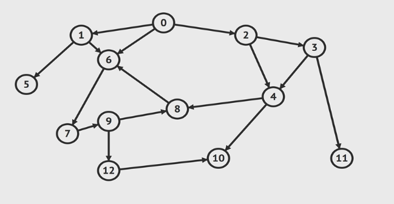

# Graphs 
### 1. Essential Graph Terms  
* __Vertex__ : a node 
* __Edge__ : connection between Nodes
* __Weighted/ Unweighted__ : values assigned to distances between vertices 
* __Directed/ Undirected__ : direction assigned to distanced between vertices
### 2. Types of Graphs
* __Undirected Graph__    
Ex) Facebook Friend Relation
* __Directed Grpah__    
Ex) Instagram Followers
* __Weighted Graph__   
Ex) Map with distance
* __Unweighted Graph__   
Ex) No value in Edge

### 3. BIG-O Compare
| Operation | Adjacency List | Adjacency Matrix |
| :----------: | :---------: | :----------: |
| Add Vertex    | O(1)       |     O(V^2)   |
| Add Edge    | O(1)       |     O(1)   |
| Remove Vertex    | O(V+E)       |     O(V^2)   |
| Remove Edge    | O(E)       |     O(1)   |
| Query    | O(V+E)       |     O(1)         |
| Storage    | O(V+E)       |     O(V^2)         |

### 4. Pro and Cons
| Adjacency List | Adjacency Matrix |
| :---------: | :----------: |
| <span style="color:green">Less Space</span>   |     <span style="color:red">More Space</span>   | 
| <span style="color:green">Fast Edge Iterate</span>   | <span style="color:red">Slow Edge Iterate</span>       | 
| <span style="color:red">Slow Edge Lookup</span>    | <span style="color:green">Fast Edge Lookup</span>    | 


### 5. Graph Traversal


#### 5 - 1. Graph Traversal Uses
* Web Crawlers - 웹 크롤링은 그래프 탐색과 같은 원리
* Facebook Friends Graph
* Shortest path problems

#### 5 - 2. Implement Approach
    이웃한 노드를 노드 선택 기준에 따라 하나씩 방문
    이미 방문한 노드에 대한 정보가 필요함 (재방문 방지)
#### 5 - 3. DFS - Depth First Traversal

1. ***Pseudo Code - Recursion***
```
DFS (vertex):
    if vertex is empty
        return (this is base case)
    add vertex to results list
    mark vertex as visited 
    for each neighbor in vertex's neighbors:
        if neighbor is not visited:
            recursively call DFS on neighbor 
```
> 방문한 노드를 표시하는덴 여러가지 방법이 있지만 이번 예제에서는 Explicit 하게 "1" : true, "2" : true로 표기  

2. ***Pseudo Code - Iterative*** 
```
DFS (start):
    let S be a stack // 스택을 이용한 구현
    S.push(start)
    while S is not empty:
        vertex = S.pop()
        if vertex is not labeled as discovered:
            visit vertex (add to result list)
            label vertex as discovered
            for each of vertex's neighbors, N do 
                S.push(N)
```
> Stack은 JS의 기본 array의 push(), pop()

#### 5 - 3. BFS - Breadth First Traversal
***Pseudo Code*** 
```
BFS (start):
    let Q be an Queue
    while Q is not empty:
        vertex = Q.shift()
        visit vertex (add to result list)
        for each of vertex's neighbors, N do
            if N is not labeled discovered:
                mark N visited
                Q.push(N)
```
> Queue는 JS의 기본 array의 push(), shift()
